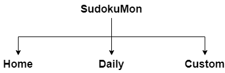

# HW Week 10

**Final Proposal Slides:** [https://docs.google.com/presentation/d/1lwaV9odwb73nMK2p0CqmuPtah6j8s9zvglLvx-wwPPY/edit?usp=sharing](https://docs.google.com/presentation/d/1lwaV9odwb73nMK2p0CqmuPtah6j8s9zvglLvx-wwPPY/edit?usp=sharing)

---

**Concept:** Pokedoku (but unlimited and customizable)  
Pokedoku is a captivating online puzzle game that blends the classic Sudoku gameplay with the beloved world of Pokémon.  

**Theme:** 
- Puzzle game
- Clean and simple; non-ambiguous layout
- Centered sudoku-like grid board

**Inspiration:** [https://pokedoku.com/](https://pokedoku.com/)

**Skills:**
- Required:
  - General HTML, CSS, JS, JSON
  - Navbar, images, flexbox, grid, modals, forms
  - Media query
- Still Need to Learn:
  - Using the PokeAPI (download JSON file?) ([https://pokeapi.co/api/v2/pokemon/?limit=9999](https://pokeapi.co/api/v2/pokemon/?limit=9999))
  - Timer

**To-Do:**
- Daily puzzle
- Customizable puzzles
- Game logic

## Sitemap/Wireframes

