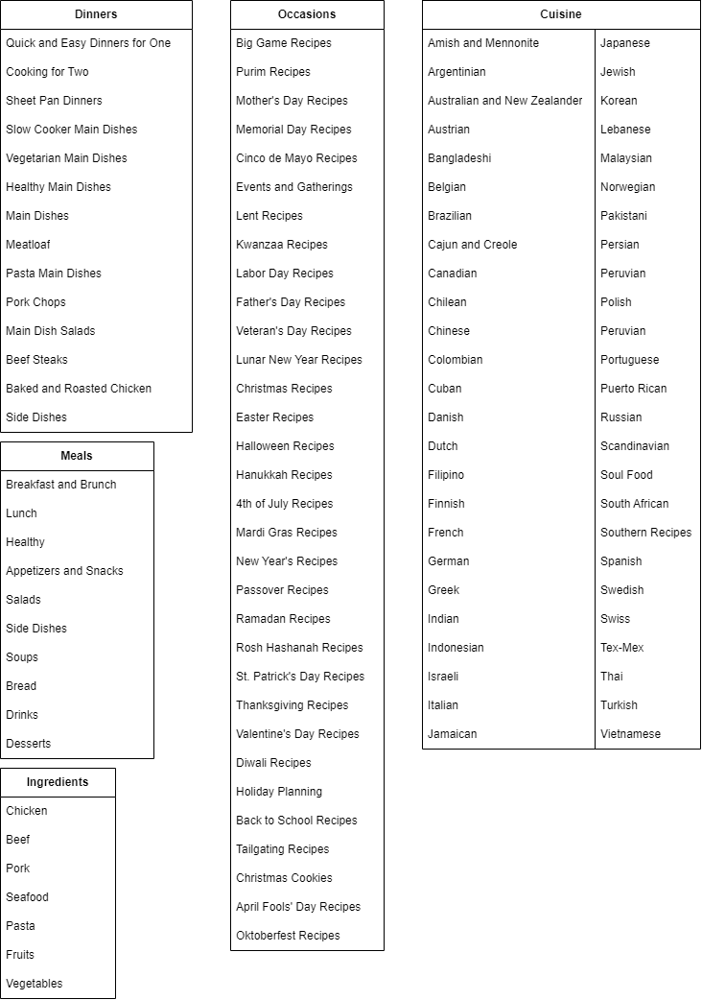
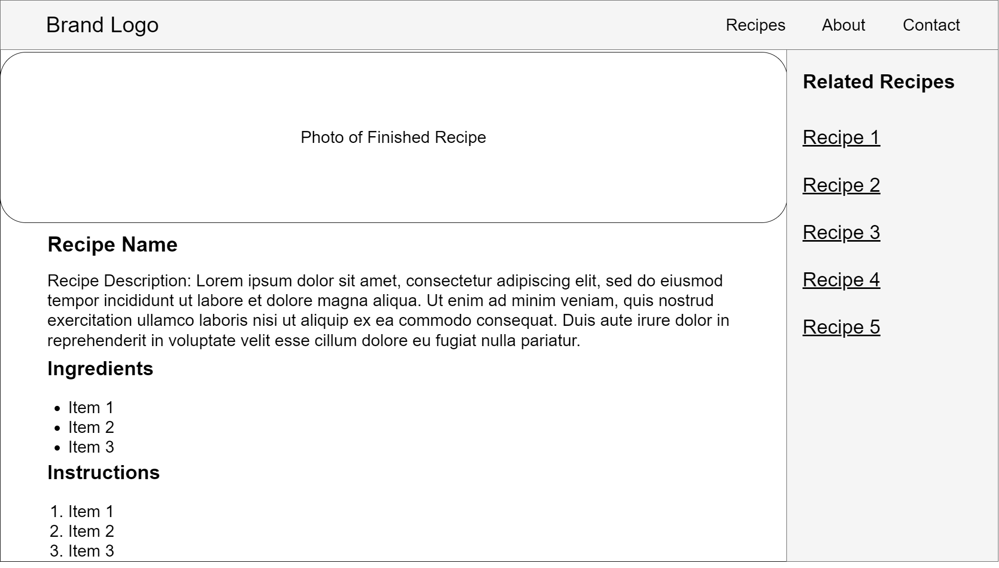
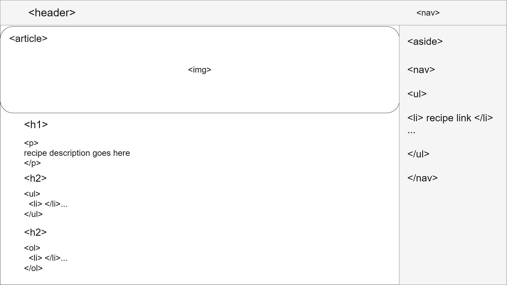

# HW2
## Part 1 - Recipe Site Information Architecture
**Source:** [https://www.allrecipes.com/](https://www.allrecipes.com/)

## Part 2 - Wireframing Article Reaction
**Source:** [http://mediatemple.net/blog/tips/five-important-considerations-for-wireframing/?utm_source=weekly_newsletter&utm_medium=email&utm_campaign=aug17newsletter](http://mediatemple.net/blog/tips/five-important-considerations-for-wireframing/?utm_source=weekly_newsletter&utm_medium=email&utm_campaign=aug17newsletter)
I thought that the article had valuable insights into the wireframing process in UX design.  One of the most interesting takeaways to me was the emphasis on clarifying the problem before diving into design.  Understanding the project's purpose, the target audience, and the underlying issues is crucial for creating effective solutions.  The article also highlighted the importance of collaboration and feedback, emphasizing the need to involve stakeholders, developers, and designers early in the process to align on technical constraints and project scope.  In addition, the mention of tailoring wireframes to the audience's needs, whether high or low-fidelity, demonstrates that the flexibility required in communication within a multidisciplinary team is essential.  Overall, the article reinforces the idea that wireframing is not just about creating visuals but is a critical part of the problem-solving and communication process of UX design.
## Part 3 - Wireframe

## Part 4 - Semantic HTML

