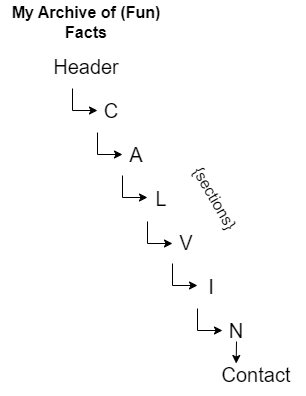
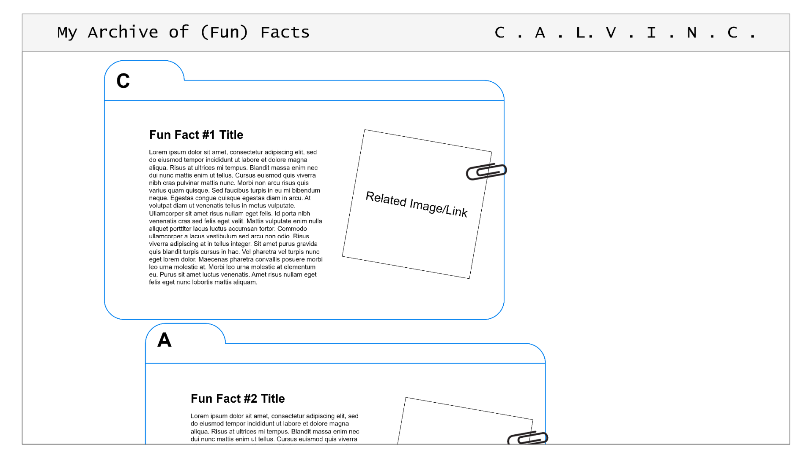
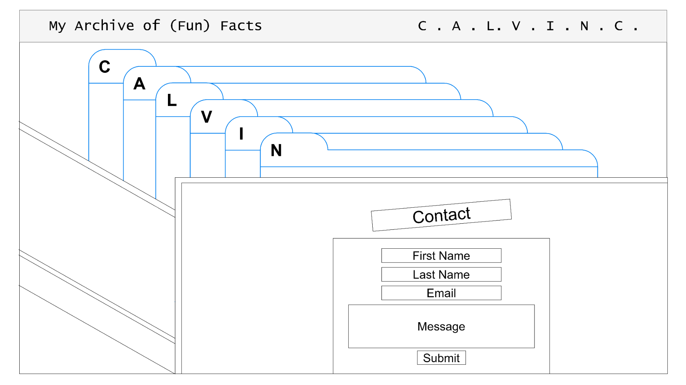

# HW4 

**Midterm Proposal Slides::** [https://docs.google.com/presentation/d/1O_XcpsY8yXd3PfK8LnxIg6v2k_GGQaI_M9C3P0lZxrE/edit?usp=sharing](https://docs.google.com/presentation/d/1O_XcpsY8yXd3PfK8LnxIg6v2k_GGQaI_M9C3P0lZxrE/edit?usp=sharing)

---

**Concept:** (Fun) Fact page about myself  

**Theme:** 
- Old, archived data/info
- File cabinet aesthetic
- Dark/dim lighting, old/rusty metal, 1950s - 1970s
  
**Inspiration:** https://www.pinterest.com/calvinc0753/midterm-inspiration/

**Skills:**
- Required:
  - General HTML, CSS
  - Navbar, sections, images, flexbox, positioning (sticky), transforms
- Potentially:
  - Media query?
- Still Need to Learn:
  - Custom polygons/shapes for divs
  - Videos?

## Sitemap/Wireframes

